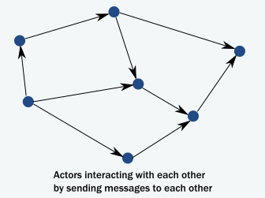
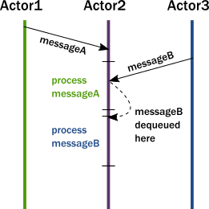
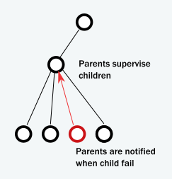

# Introduction

Open-source libraries for designing scalable, resilient systems that span processor cores and networks.

# Why modern systems need a new programming model

Actor 모델은 수십년전에 고성능 네트워크에서 병렬처리를 위해 Carl Hewitt에 의해서 제안된 개념이다. 하지만 그때는 개념을 구현할만한 환경 요건이 갖춰지지 않았다. 

### The challenge of encapsulation

- 객체의 내부 상태는 싱글 스레드에서 접근이 유효하지만 멀티스레드에서의 접근에서는 내부 상태를 보존하기 어렵다.
- 결국에 Lock을 활용할 수 밖에 없으나 비효율적이며 데드락을 유발할 수 있음 
- 더군다나 락은 로컬에서 동작할 수 밖에 없어서 분산시스템에서는 스케일 아웃에 걸림돌이 된다.

### The illusion of a call stack

- 현대 시스템에서 타스크를 스레드간 위임하는 것은 흔한 일임. 그런데 이 경우 위임한 타스크에서 오류가 발생하면 그 결과를 위임했던 스레드로 통보해야함. 실패처리가 주요한 도메인이 되어버림.
- 동시성 시스템에서 타스크나 메시지가 제대로 처리되고 있는지 클라이언트가 다 챙겨야 함. 장애가 날수도 있고 응답 안오면 타임아웃 내야 되고 위임한 시스템에서 장애날수도 있고 챙기기 너무 복잡함.

# How the Actor Model Meets the Needs of Modern, Distributed Systems

액터를 사용하면 다음과 같은 일을 할 수 있다.

- 락에 의존하지 않는 캡슐화
- Cooperative 엔티티 모델(서로 간의 신호에 반응하고, 상태를 변경하고 신호를 전송한다.)을 사용한다.
- 일반적으로 생각하는 실행 메커니즘에 따라 수행하게 한다.

### Usage of message passing avoids locking and blocking

메소드를 호출하는 대신에 서로 간에 메시지를 전달한다. 액터는 메시지를 블락킹 없이 전달하고 처리를 수행한다. 그러므로 같은 시간에 많은 작업을 수행할 수 있다.

객체에서는 메소드가 리턴될때 스레드의 제어권을 릴리이즈한다. 액터도 객체처럼 메시지 처리가 종료되면 응답하고 실행을 리턴한다. 

메소드 호출과 메시지 전송의 가장 큰 차이는 리턴값이 없다는 것이다. => 그래서 콜스택을 챙길 필요가 없다.

액터가 메시지를 처리 하는 동안 다른 액터들도 동시에 다른 메시지를 처리한다. 

액터가 메시지를 받았을 때 동작은 다음과 같이 요약된다. 

- 액터는 메시지를 큐의 마지막에 더한다.
- 액터가 실행중이 아니라면 실행할 준비가 되었다고 마크 
- 숨겨진 스케쥴러가 액터를 선택해서 실행을 시작함
- 액터를 큐에 있는 첫번째 메시지를 선택
- 액터는 내부 상태를 변경하고 다른 액터에게 메시지를 전송
- 액터는 스케쥴을 해제

액터는 아래와 같은 것들로 구성된다.

- mailbox(메시지를 저정하는 큐
- behavior(액터의 상태, 내부 변수 등)
- messages(데이터를 표현하는 신호, 메소드 호출과 호출시 사용되는 파라미터와 비슷함)

이런 단순한 모델은 앞에서 언급한 다양한 문제들은 쉽게 해결할 수 있게 해준다.

- 시그널로 부터 실행을 디커플링하여 캡슐화를 보존한다.(메소드 콜은 실행을 전송하지만 메시지 전송은 그렇지 않다.)
- 락이 필요없다. 액터의 내부 상태 변경은 오직 메시지를 통해서만 가능하다. 한번에 하나의 메시지만 처리하기때문에 경쟁이 발생하지 않으며 불변성을 지킬수 있다.
- 어디에도 락이 존재하지 않으며 전송자는 블럭되지 않는다. 수십개의 스레드로 수백만의 액터가 효율적으로 스케쥴링을 하여 사용한다.
- 액터의 상태는 공유되지 않는다. 데이터의 변경 및 전파는 메시지를 통해서만 전달된다. 리모트로 가더라도 똑같은 모델이 유지된다. 

### Actors handle error situations gracefully

콜스택을 공유하지 않으므로 에러처리도 달라진다.

- 첫번째 케이스는 위임된 타스크가 타겟 액터에서 오류가 났을 경우이다. 타겟 액터는 서비스 캡슐화에 대해서 보호된다. 이제 오류는 타겟 액터의 몫이다. 타겟 액터는 메시지를 전송하거나 에러를 출력하거나 알아서 하면 된다. 이로서 에러 처리는 더이상 특별하지 않아진다.
- 두번째 케이스는 서비스 자체의 시스템 폴트이다. 아카는 트리 구조로 모든 액터들을 관리한다. 마치 OS 시스템이 프로세스들을 트리에 넣는 거랑 유사하다. 액터가 폴트가 나면 부모 액터는 실패에 대응한다. 또한 부모 액터가 중지되면 자신의 자식 액터들도 재귀적으로 중지된다.

부모는 자식을 재시작하거나 아에 종료시키거나를 결정할 수 있다. 부모가 주기적으로 감시하기 때문에 자식은 절대 조용히 죽을 수 없다.

